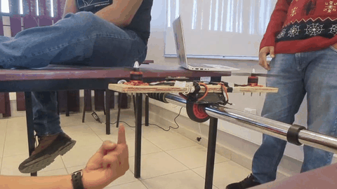
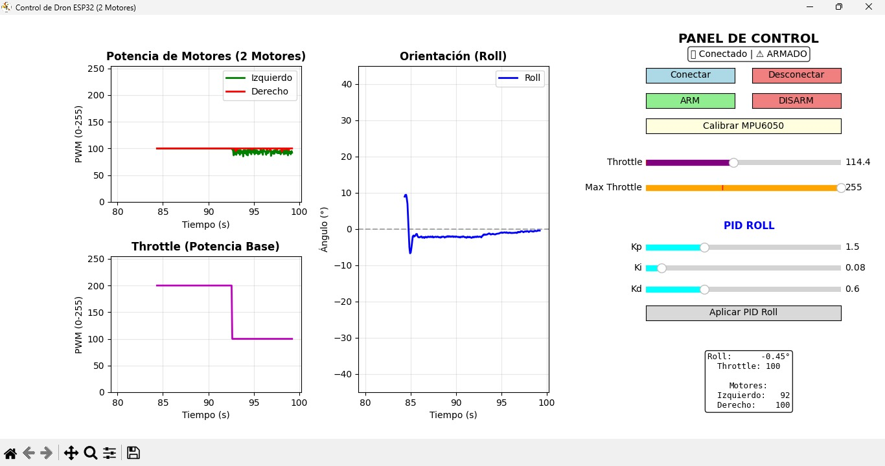

# Proyecto Dron - Control Clásico (Alabeo)

<div align="center">
  
  
  
  <br/><br/>
  
  
  
  
  
  
  
</div>




Este proyecto contiene el código para el control de un dron utilizando ESP32 y sensores MPU6050.

## Archivos Principales

### Codigo_ESP32/
- **esp_2motores.py**: Script (MicroPython) para el ESP32 que controla 2 motores del dron.

### Interfaz_PC/
- **Interfaz_Control_2motores.py**: Interfaz de control para la PC con gráficos para monitorear y controlar el dron de 2 motores.
- **ControlDRONE_4motores.py**: Interfaz de control avanzada para la PC que permite monitorear y controlar un dron completo de 4 motores.

## Requisitos

- Python 3.x
- ESP32
- Sensor MPU6050
- Bibliotecas Python necesarias en la PC: `matplotlib`, `numpy` (Instalables vía `pip install matplotlib numpy`)

## Uso

### Control de 2 motores (Pruebas/Prototipo)
1. Cargar el código `Codigo_ESP32/esp_2motores.py` en el ESP32.
2. Ejecutar `Interfaz_PC/Interfaz_Control_2motores.py` en la computadora para controlar el prototipo.

### Control de 4 motores (Completo)
1. Ejecutar `Interfaz_PC/ControlDRONE_4motores.py` en la computadora (Nota: requerirás el código de ESP32 para 4 motores cargado en tu dron).

## Estructura del Proyecto

```text
Proyecto Dron/
├── Codigo_ESP32/           # Código principal para la tarjeta ESP32 (MicroPython)
├── Interfaz_PC/            # Scripts con interfaz gráfica de Python para controlar el dron vía WiFi
├── Piezas/                 # Modelos 3D y piezas mecánicas (archivos STEP, etc.)
└── Esquematico_PDB/        # Esquemas de la placa de distribución de energía (Power Distribution Board)
```

